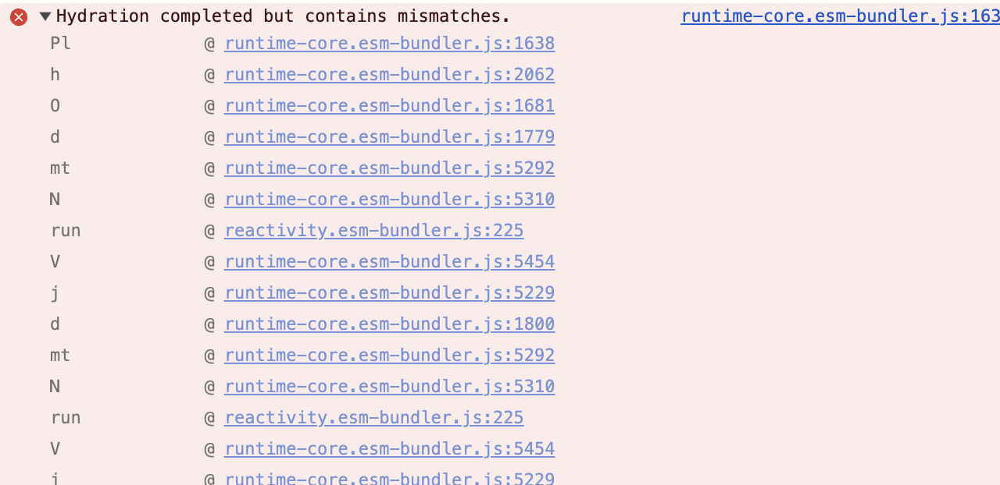

# Nuxt + Nitro Reproduction

## Bugs

Upgrading to `nuxt@3.14.1592` (which includes `nitropack@2.10.4`) introduces the following bugs:

1. A hydration error that only appears when building and then previewing (or deploying) with `wrangler` and the `cloudflare-module` preset (I did not test other presets).

    
2. The bug also causes component styles added via `useHead` in the `CustomComponent.vue` file to not be added to the page during SSR; you can verify by refreshing the page and viewing the page source. Search for `my-component` and notice the styles are not included in the static HTML returned from the server.

I've narrowed down the issue to the [`nuxt@3.14.1592` version](https://github.com/nuxt/nuxt/releases/tag/v3.14.1592).

The issue was _possibly_ introduced in [#29957](https://github.com/nuxt/nuxt/pull/29957) (my best guess :grimacing:).

## Reproduction

1. Install dependencies
2. Run `pnpm dev` and open your browser console. You’ll notice there are no hydration errors.
3. Run `pnpm wrangler:dev` which builds the project and serves it locally
4. Open the page, and inspect the console. You'll see the hydration error.
5. Inspect the `red` text on the page, and notice the styles are bound via a selector of `#my-component`
6. Right-click the page, and "View page source." Search for the string `my-component` and notice it does not appear in the server-rendered HTML
7. Stop the server, and install the previous version of Nuxt: `pnpm add nuxt@3.14.159`
8. Walk through steps 3 - 6 and notice the hydration error is gone, and the `#my-component` styles are now present in the server-rendered HTML.

## What else I tried

- I tried downgrading `nitropack` all the way back to version `2.10.0` via `pnpm.overrides`; however, the issue persists as long as Nuxt is installed with version `3.14.1592` specifically. If I install `3.14.159` instead, everything works correctly.
- I also force-upgraded `nitropack` to the latest, also with overrides, and pinned nuxt to the working version `3.14.159` and the issue is not present.

I'm confident the issue, although only seemingly surfaced when building with Cloudflare and the `cloudflare-module` preset (at least, in my testing), appears to have been introduced by Nuxt, not Nitro.

